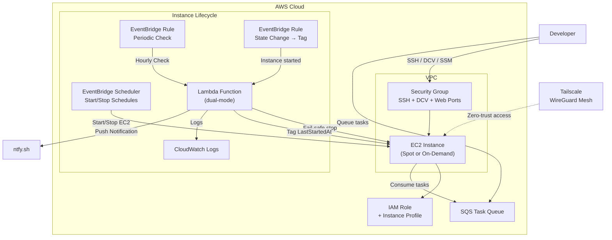

# Terraform AWS Dev Workstation

A Terraform module for deploying an EC2 development environment with NICE DCV remote desktop — a dedicated Linux box in the cloud for running AI coding agents like [Claude Code](https://docs.anthropic.com/en/docs/claude-code) and [OpenClaw](https://github.com/anthropics/openclaw) without tying up your personal machine.

## Architecture



## Features

- **Ubuntu 24.04 LTS** with minimal desktop environment
- **NICE DCV** remote desktop for GUI access (browser-based)
- **Tailscale** zero-trust networking with auto-provisioned TLS certs
- **Scheduled start/stop** via EventBridge Scheduler with timezone support
- **Spot instances** for 60-70% cost savings
- **Auto-stop fail-safe** with ntfy.sh notifications to prevent runaway costs
- **SQS task queue** to queue work even when the instance is off
- **Pre-installed tools**: Docker, Node.js, Chrome, AWS CLI
- **SSH key generation** managed by Terraform
- **SSM Session Manager** for secure shell access without SSH

## Quick Start

### Prerequisites

- AWS CLI configured with credentials
- Terraform >= 1.0
- Terragrunt >= 0.50 (optional, but recommended)

### Using Terragrunt (Recommended)

1. Copy the example configuration:
   ```bash
   cp terragrunt/terragrunt.hcl my-config/terragrunt.hcl
   ```

2. Edit `my-config/terragrunt.hcl` and replace all 3 occurrences of `YOUR_IP_ADDRESS/32` with your public IP:
   ```bash
   # Find your IP
   curl -s https://checkip.amazonaws.com/
   ```
   These appear in `allowed_ssh_cidrs`, `allowed_dcv_cidrs`, and `web_dev_cidrs`.

3. Deploy:
   ```bash
   cd my-config
   terragrunt init
   terragrunt apply
   ```

4. **Wait for cloud-init to finish** (~10-15 minutes on first launch). The instance is installing a desktop environment, DCV, Docker, Chrome, and other tools. You can monitor progress with:
   ```bash
   # Via SSM (works immediately, no SSH key needed)
   aws ssm start-session --target $(terragrunt output -raw instance_id)
   # Then inside the session:
   tail -f /var/log/user-data.log
   ```

5. Save your SSH key:
   ```bash
   terragrunt output -raw private_key_pem > ~/.ssh/dev-workstation-key.pem
   chmod 600 ~/.ssh/dev-workstation-key.pem
   ```

> **Note:** The module uses the default VPC and subnet if `vpc_id` and `subnet_id` are not provided. If your AWS account doesn't have a default VPC, you must set these variables explicitly. All other optional features (Tailscale, scheduling, SQS, etc.) are disabled by default and not required for a basic deployment.

### Using Terraform Directly

1. Create a `main.tf`:
   ```hcl
   module "dev_workstation" {
     source = "./terraform"

     name              = "dev-workstation"
     instance_type     = "m7i-flex.large"
     create_key_pair   = true
     use_spot_instance = true

     allowed_ssh_cidrs = ["YOUR_IP/32"]
     allowed_dcv_cidrs = ["YOUR_IP/32"]

     enable_auto_stop = true
     stop_after_hours = 4
   }

   output "connection_info" {
     value = module.dev_workstation.connection_info
   }
   ```

2. Deploy:
   ```bash
   terraform init
   terraform apply
   ```

## Deployment Options

### Basic (Public IP + Security Groups)

The default configuration exposes SSH and DCV via the instance's public IP, restricted to your IP address through security group rules. DCV serves a self-signed certificate, so your browser will show a security warning on first connect.

This is the simplest setup — just replace `YOUR_IP_ADDRESS/32` and deploy.

### With Tailscale (Recommended for Regular Use)

Tailscale creates a private WireGuard mesh network between your devices. With Tailscale enabled, you access the workstation over the Tailscale network instead of the public internet. This provides:

- **No security group rules needed** — traffic flows over the encrypted Tailscale tunnel
- **Valid TLS certificates** — auto-provisioned from Let's Encrypt, no browser warnings
- **SSH over Tailscale** — `ssh ubuntu@<hostname>` without managing SSH keys
- **Stable hostname** — access via `<hostname>.<tailnet>.ts.net` instead of changing public IPs

**Prerequisites:**
1. Create a [Tailscale account](https://tailscale.com/) (free for personal use)
2. Install Tailscale on your local machine
3. Enable HTTPS certificates in [Tailscale admin DNS settings](https://login.tailscale.com/admin/dns)
4. Generate an auth key at [Tailscale admin > Settings > Keys](https://login.tailscale.com/admin/settings/keys)

**Add to your terragrunt.hcl inputs:**
```hcl
install_tailscale   = true
tailscale_auth_key  = "tskey-auth-XXXX"  # Use SOPS or env vars for production
enable_dcv_port_443 = true               # Access DCV on https://<hostname>:443
```

After deploy, access DCV at `https://<hostname>.<tailnet>.ts.net` with a valid TLS certificate. You can also remove the `allowed_ssh_cidrs` and `allowed_dcv_cidrs` entries since Tailscale traffic bypasses security groups entirely.

### With Scheduled Start/Stop

Automatically start and stop the instance on a schedule to control costs. Pair with the auto-stop fail-safe as a safety net.

**Add to your terragrunt.hcl inputs:**
```hcl
enable_scheduled_start = true
schedule_timezone      = "America/New_York"

# 3 work windows: morning, midday, evening
schedule_start_expressions = [
  "cron(0 7 ? * MON-FRI *)",   # 7 AM ET
  "cron(0 12 ? * MON-FRI *)",  # 12 PM ET
  "cron(0 17 ? * MON-FRI *)",  # 5 PM ET
]
schedule_stop_expressions = [
  "cron(0 10 ? * MON-FRI *)",  # 10 AM ET
  "cron(0 15 ? * MON-FRI *)",  # 3 PM ET
  "cron(0 20 ? * MON-FRI *)",  # 8 PM ET
]

enable_auto_stop = true
stop_after_hours = 4  # Fail-safe in case a scheduled stop fails
```

### With SQS Task Queue

Add a task queue so you can submit work to the workstation even when it's stopped.

**Add to your terragrunt.hcl inputs:**
```hcl
enable_task_queue = true
```

After deploy, send tasks with:
```bash
aws sqs send-message \
  --queue-url $(terragrunt output -raw task_queue_url) \
  --message-body "Your task description here"
```

## Connecting

### NICE DCV (Remote Desktop)

1. Get the DCV URL from outputs:
   ```bash
   terragrunt output dcv_url
   ```

2. Open the URL in your browser

3. Login with:
   - Username: `ubuntu`
   - Password: `CHANGE_ME_IMMEDIATELY` (change this after first login!)

### With Tailscale

When Tailscale is enabled, access DCV via your Tailscale hostname:
```
https://<hostname>.<tailnet>.ts.net:8443
```

If `enable_dcv_port_443` is set, use port 443 instead:
```
https://<hostname>.<tailnet>.ts.net
```

Tailscale auto-provisions TLS certificates from Let's Encrypt, so there are no browser security warnings. This requires enabling HTTPS certificates in Tailscale admin DNS settings.

### HTTPS Certificates for DCV

**Default (Tailscale):** When `install_tailscale` is enabled alongside DCV, the module automatically provisions a Tailscale TLS certificate and configures a systemd service to re-provision it on each boot (DCV overwrites its certs on restart).

**Alternative (Certbot):** If you're not using Tailscale, you can use Certbot with a domain you control:
```bash
sudo apt-get install -y certbot
sudo certbot certonly --standalone -d your-host.example.com
sudo cp /etc/letsencrypt/live/your-host.example.com/fullchain.pem /var/lib/dcv/.config/NICE/dcv/private/dcv.pem
sudo cp /etc/letsencrypt/live/your-host.example.com/privkey.pem /var/lib/dcv/.config/NICE/dcv/private/dcv.key
sudo chown dcv:dcv /var/lib/dcv/.config/NICE/dcv/private/dcv.{pem,key}
sudo chmod 600 /var/lib/dcv/.config/NICE/dcv/private/dcv.key
sudo systemctl restart dcvserver
```

> **Note:** DCV ignores the `[security]` section in `dcv.conf` and always loads certs from `/var/lib/dcv/.config/NICE/dcv/private/dcv.pem`. Place your certs there directly.

### SSH

```bash
ssh -i ~/.ssh/dev-workstation-key.pem ubuntu@<public-ip>
```

### SSM Session Manager

```bash
aws ssm start-session --target <instance-id>
```

## Scheduled Start/Stop

The module supports automated start/stop schedules using EventBridge Scheduler with native IANA timezone support:

```hcl
enable_scheduled_start = true
schedule_timezone      = "America/New_York"

schedule_start_expressions = [
  "cron(0 7 ? * MON-FRI *)",   # 7:00 AM ET
  "cron(0 12 ? * MON-FRI *)",  # 12:00 PM ET
  "cron(0 17 ? * MON-FRI *)",  # 5:00 PM ET
]

schedule_stop_expressions = [
  "cron(0 10 ? * MON-FRI *)",  # 10:00 AM ET
  "cron(0 15 ? * MON-FRI *)",  # 3:00 PM ET
  "cron(0 20 ? * MON-FRI *)",  # 8:00 PM ET
]
```

The auto-stop Lambda serves as a fail-safe: if a scheduled stop fails or you manually start the instance, it will still be stopped after `stop_after_hours`. The Lambda tracks actual runtime using a `LastStartedAt` tag that resets on every start (not EC2 `LaunchTime`, which only resets on initial launch).

## SQS Task Queue

The optional SQS task queue lets you submit work to the workstation even when the instance is stopped. Messages persist in the queue for up to 14 days, so you can queue tasks from your local machine at any time. When the instance starts up (either on schedule or manually), a consumer service running on the instance can poll the queue and process pending tasks automatically.

This is useful for asynchronous workflows — for example, sending a task like "check email and draft replies" before your morning work window starts. By the time the scheduled start brings the instance up, the task is already waiting in the queue.

```bash
aws sqs send-message \
  --queue-url $(terragrunt output -raw task_queue_url) \
  --message-body "Check email and draft social media posts"
```

The instance role has `sqs:ReceiveMessage` and `sqs:DeleteMessage` permissions scoped to the task queue. You provide the consumer service — the module only creates the queue and the IAM permissions for the instance to read from it.

## Instance Management

### Start/Stop

```bash
# Stop
aws ec2 stop-instances --instance-ids <instance-id>

# Start
aws ec2 start-instances --instance-ids <instance-id>
```

### Defer Auto-Stop

If you need more time before auto-stop:
```bash
# Add 2 hours to the auto-stop timer
aws ec2 create-tags --resources <instance-id> --tags Key=AutoStopDeferHours,Value=2
```

### Get Instance IP After Restart

Since the instance doesn't have an Elastic IP by default, the IP changes on restart:
```bash
aws ec2 describe-instances --instance-ids <instance-id> \
  --query 'Reservations[0].Instances[0].PublicIpAddress' --output text
```

### Elastic IP (Optional)

By default, `create_eip` is set to `false`. This means the instance's public IP address will change each time it's stopped and started.

**When you don't need an Elastic IP:**
- You're okay fetching the new IP after each restart (see command above)
- You don't need a static IP for firewall rules or DNS records
- You want to save ~$3.60/month

**When you might want an Elastic IP:**
- You need a stable IP for external firewall allowlists
- You're pointing a DNS record at the instance
- You want to avoid looking up the IP after each restart

To enable, set `create_eip = true` in your configuration.

## Configuration Options

| Variable | Description | Default |
|----------|-------------|---------|
| `instance_type` | EC2 instance type | `m7i.xlarge` |
| `root_volume_size` | EBS volume size in GB | `100` |
| `use_spot_instance` | Use spot pricing | `false` |
| `create_eip` | Create Elastic IP for static address | `false` |
| `install_desktop` | Install Ubuntu desktop | `true` |
| `install_dcv` | Install NICE DCV | `true` |
| `install_chrome` | Install Google Chrome | `true` |
| `install_docker` | Install Docker | `true` |
| `install_nodejs` | Install Node.js LTS | `true` |
| `install_tailscale` | Install Tailscale VPN | `false` |
| `enable_dcv_port_443` | Redirect port 443 to DCV (8443) | `false` |
| `enable_scheduled_start` | Enable EventBridge Scheduler | `false` |
| `schedule_timezone` | IANA timezone for schedules | `America/New_York` |
| `enable_auto_stop` | Enable fail-safe auto-stop Lambda | `false` |
| `stop_after_hours` | Fail-safe stop after N hours | `4` |
| `enable_task_queue` | Create SQS task queue | `false` |

See `terraform/variables.tf` for the complete list.

## Cost Estimate

With spot pricing in us-east-1:
- **m7i-flex.large spot**: ~$0.03-0.04/hour
- **100GB gp3 storage**: ~$8/month
- **Data transfer**: Varies by usage
- **SQS**: Effectively free (1M requests/month free tier)
- **EventBridge Scheduler**: Free (14M invocations/month free tier)

**Estimated monthly cost** (8 hours/day, 20 days/month): **$12-20**

Without auto-stop, a forgotten instance could cost $30-50/month.

## Security Considerations

1. **Change the default DCV password** immediately after first login
2. **Restrict CIDR blocks** to your IP address only
3. **Use Tailscale** for zero-trust access (eliminates need for public security group rules)
4. **Enable auto-stop** to prevent runaway costs
5. **Use SSM Session Manager** for production environments (no open SSH port)
6. **Review IAM permissions** before adding additional policies
7. **Encrypt sensitive inputs** (like `tailscale_auth_key`) using SOPS or environment variables

## License

MIT
