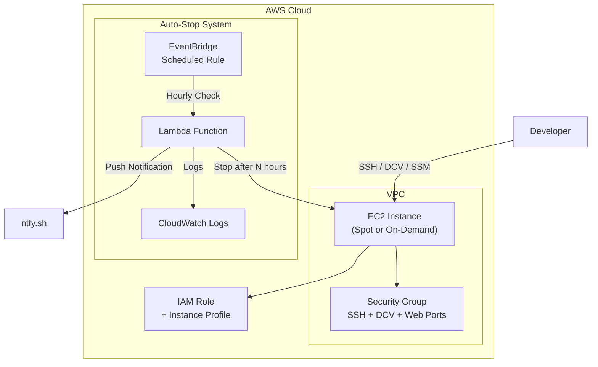

# Terraform AWS Dev Workstation

A Terraform module for deploying a sandboxed EC2 development environment with NICE DCV remote desktop, ideal for running AI coding agents like Claude Code with full permissions in an isolated environment.

## Architecture



## Features

- **Ubuntu 24.04 LTS** with minimal desktop environment
- **NICE DCV** remote desktop for GUI access (browser-based)
- **Spot instances** for 60-70% cost savings
- **Auto-stop** with notifications to prevent runaway costs
- **Pre-installed tools**: Docker, Node.js, Chrome, AWS CLI
- **SSH key generation** managed by Terraform
- **SSM Session Manager** for secure shell access without SSH

## Quick Start

### Prerequisites

- AWS CLI configured with credentials
- Terraform >= 1.0
- Terragrunt >= 0.50 (optional, but recommended)

### Using Terragrunt (Recommended)

1. Copy the example configuration:
   ```bash
   cp terragrunt/terragrunt.hcl my-config/terragrunt.hcl
   ```

2. Edit `my-config/terragrunt.hcl` and replace:
   - `YOUR_IP_ADDRESS/32` with your public IP (find it at https://checkip.amazonaws.com/)
   - Optionally configure S3 backend for remote state

3. Deploy:
   ```bash
   cd my-config
   terragrunt init
   terragrunt apply
   ```

4. Save your SSH key:
   ```bash
   terragrunt output -raw private_key_pem > ~/.ssh/dev-workstation-key.pem
   chmod 600 ~/.ssh/dev-workstation-key.pem
   ```

### Using Terraform Directly

1. Create a `main.tf`:
   ```hcl
   module "dev_workstation" {
     source = "./terraform"

     name              = "dev-workstation"
     instance_type     = "m7i.xlarge"
     create_key_pair   = true
     use_spot_instance = true

     allowed_ssh_cidrs = ["YOUR_IP/32"]
     allowed_dcv_cidrs = ["YOUR_IP/32"]

     enable_auto_stop   = true
     notify_after_hours = 5
     stop_after_hours   = 6
   }

   output "connection_info" {
     value = module.dev_workstation.connection_info
   }
   ```

2. Deploy:
   ```bash
   terraform init
   terraform apply
   ```

## Connecting

### NICE DCV (Remote Desktop)

1. Get the DCV URL from outputs:
   ```bash
   terragrunt output dcv_url
   # or
   terraform output dcv_url
   ```

2. Open the URL in your browser (accept the self-signed certificate)

3. Login with:
   - Username: `ubuntu`
   - Password: `CHANGE_ME_IMMEDIATELY` (change this after first login!)

### SSH

```bash
ssh -i ~/.ssh/dev-workstation-key.pem ubuntu@<public-ip>
```

### SSM Session Manager

```bash
aws ssm start-session --target <instance-id>
```

## Instance Management

### Start/Stop

```bash
# Stop
aws ec2 stop-instances --instance-ids <instance-id>

# Start
aws ec2 start-instances --instance-ids <instance-id>
```

### Defer Auto-Stop

If you need more time before auto-stop:
```bash
# Add 2 hours to the auto-stop timer
aws ec2 create-tags --resources <instance-id> --tags Key=AutoStopDeferHours,Value=2
```

### Get Instance IP After Restart

Since the instance doesn't have an Elastic IP by default, the IP changes on restart:
```bash
aws ec2 describe-instances --instance-ids <instance-id> \
  --query 'Reservations[0].Instances[0].PublicIpAddress' --output text
```

## Configuration Options

| Variable | Description | Default |
|----------|-------------|---------|
| `instance_type` | EC2 instance type | `m7i.xlarge` |
| `root_volume_size` | EBS volume size in GB | `100` |
| `use_spot_instance` | Use spot pricing | `false` |
| `enable_auto_stop` | Enable auto-stop Lambda | `false` |
| `notify_after_hours` | Hours before warning notification | `5` |
| `stop_after_hours` | Hours before auto-stop | `8` |
| `install_desktop` | Install Ubuntu desktop | `true` |
| `install_dcv` | Install NICE DCV | `true` |
| `install_chrome` | Install Google Chrome | `true` |
| `install_docker` | Install Docker | `true` |
| `install_nodejs` | Install Node.js LTS | `true` |

See `terraform/variables.tf` for the complete list.

## Cost Estimate

With spot pricing in us-east-1:
- **m7i.xlarge spot**: ~$0.04-0.06/hour
- **100GB gp3 storage**: ~$8/month
- **Data transfer**: Varies by usage

**Estimated monthly cost** (8 hours/day, 20 days/month): **$15-25**

Without auto-stop, a forgotten instance could cost $30-50/month.

## Security Considerations

1. **Change the default DCV password** immediately after first login
2. **Restrict CIDR blocks** to your IP address only
3. **Enable auto-stop** to prevent runaway costs
4. **Use SSM Session Manager** for production environments (no open SSH port)
5. **Review IAM permissions** before adding additional policies

## License

MIT
